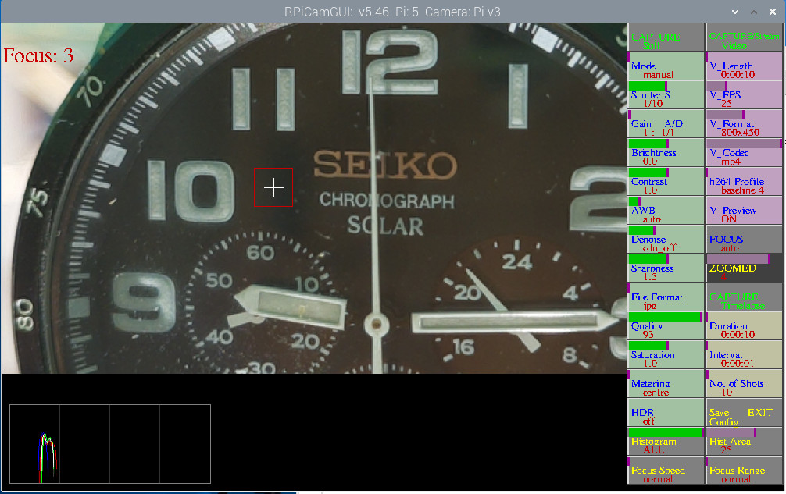
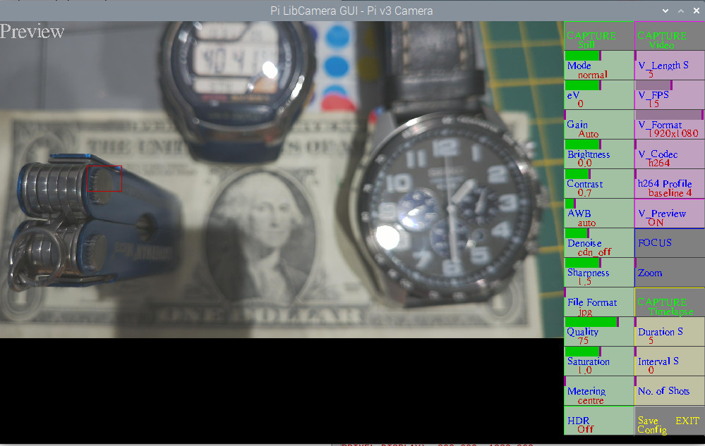

# RPiCamGUI

To work with RaspiOS based on BULLSEYE / BOOKWORM, using rpicam / libcamera (NOT raspistill/raspivid).

Preview uses rpicam-vid (so may not be as sharp as captured stills), stills rpicam-still, videos rpicam-vid, timelapses depends on timings and settings, rpicam-still, -vid or -raw. Note preview has a maximum shutter setting of 1 second.

At your own risk !!. Ensure you have any required software backed up.

Pi4B or Pi5B recommended, but will work on others including Zero2W

Script to allow control of a Pi Camera. Will work with all Pi camera models, v1, v2, v3, HQ and GS. Also Arducam 16MP or 64MP Autofocus cameras or Waveshare imx290-83 camera. 

To start streaming right mouse click on CAPTURE/Stream video button. Set streaming type in the script. 
Time of streaming set by v_length.

## Screenshot




## Arducam 16MP or 64MP HAWKEYE AF camera on Pi4/Pi5...

You need to do the Arducam install. https://docs.arducam.com/Raspberry-Pi-Camera/Native-camera/16MP-IMX519/ or https://docs.arducam.com/Raspberry-Pi-Camera/Native-camera/64MP-Hawkeye/ 
Remember to add suitable dtoverlay for camera eg. dtoverlay=imx519 or dtoverlay=arducam-64mp to /boot/config.txt or /boot/firmware/config.txt. Add cam0 or cam1 on a Pi5 as appropriate.

On a Pi4 In /boot/firmware/config.txt add  dtoverlay=vc4-kms-v3d,cma-512 and then reboot.


## Arducam 64MP OWLSIGHT camera on Pi4/Pi5...

The 64MP OWLSIGHT camera should work without needing the Arducam install just add dtoverlay=ov64a40 to /boot/config.txt. (No guarantee 16/64MP will work on less than a Pi4!)

## Waveshare imx290-83
add dtoverlay=imx290,clock-frequency=37125000 to config.txt , add cam0 or cam1 if using a Pi5.
You may need to add https://github.com/raspberrypi/libcamera/blob/next/src/ipa/rpi/pisp/data/imx290.json as imx290.json to /usr/share/libcamera/ipa/rpi/pisp if using a Pi5

To add IR Filter switching put a wire between GPIO26 (pin37) on the Pi and the GPIO 'hole' on the camera.

## HDR
A Pi v3 camera now has more HDR options: OFF, SINGLE EXPOSURE, AUTO, SENSOR.

On a Pi5 you can switch Single Exposure ON for any camera.

## External trigger
GPIO12 connected to gnd will trigger a capture. On any camera except Pi v3 you can set it to trigger STILL, VIDEO, STREAM or TIMELAPSE from the menu, on a Pi V3 you need to set your choice by changing str_cap in the script, default STILL.

## Focus

With Pi V3 or Arducam 16/64MP Click on FOCUS button to focus. This will show manual which gives Manual Focusing, then click on 'slider' or the middle of the button, left <<< or right >>> for fine adjustment, to adjust Manual Focus. Click on the image where you want to focus and it will show a value for focus in the top left corner, adjust for a maximum. Click on lower part of the button to goto continuous , and again to go back to auto focus.

With the Pi V3 or Arducam  cameras you can add 2 focus buttons to the Pi,up and down, GPIOs 21 & 26, to switch to gnd, to manually focus.

Spot focussing (focus point) in Auto Focus - ONLY with AF cameras - with Zoom not in use and Focussing not in manual click on the point in the preview image you want the camera to focus on (see image below). A red box will appear to show where it's focussing. To return to normal either click below the preview image or switch to manual FOCUS and back to auto.

If not using a v3 camera in Manual or spot focus stills will use autofocus-at-capture

## other features

Gain shows analog and digital gain. Green shows analog gain, when increased beyond a level will show yellow when applying digital gain.
eg 153 : 64/2.4 means gain set to 153, analog gain is 64, digital gain is 2.4
When a still is captured will show Analogue Gain, Digital Gain and Exposure time.

When using Zoom it will show a focus value, and an option of a histogram showing RGB and/or L, all based on the area shown, the area can be moved by clicking on the image, and changed using the Hist Area button.

2x2 binning option for 64MP camera, Click on right hand side of the Capture Still or Capture Timelapse buttons. 

For use with Hyperpixel square display set preview_width  = 720, preview_height = 540, sq_dis = 1 

If you want a fullscreen display set fullscreen = 1 in the script. if using a full HD screen (1920×1080) then set preview-width to 1440 and preview-height to 1080, fullscreen = 1

lf you want to use HQ imx477_scientific.json the file needs to be in /usr/share/libcamera/ipa/raspberrypi/imx477_scientific.json, except for a pi5 where it needs to be in usr/share/libcamera/ipa/rpi/pisp/ . see https://forums.raspberrypi.com/viewtopic.php?t=343449#p2068315. available here... https://github.com/raspberrypi/libcamera/blob/main/src/ipa/rpi/pisp/data/imx477_scientific.json

Shows a reduced preview but saves stills at camera full resolution, and videos at user set resolution.

Can also save timelapses. If you want to capture high resolution images as fast as possible using Timelapse set Interval to 0, set Duration to required seconds, set V_FPS to max, set V_Coder to mjpeg or raw , set V_Format to maximum value, click on CAPTURE Timelapse to start. The images will be in /home/.username./Pictures. If using Arducam 16MP or 64MP AF camera you will need more memory allocated to achieve full resolution if using Timelapse. In /boot/config.txt set dtoverlay=vc4-kms-v3d,cma-512 and then reboot. Note for fastest timelapse it uses libcamera-vid so not the highest quality images or libcamera-raw if v_codec set to raw.

To convert RAWs to TIF from a Pi v1,v2,v3 or HQ camera try https://github.com/Gordon999/PiRAW2TIF

With a Pi HQ Camera will allow exposures upto 650 seconds. (Note Pi v1 limited to approx 1.1 seconds, and v3 to approx 1.7 seconds ( at present) due to libcamera), Arducam 16 and 64mp cameras upto 200 and 435 seconds.

Click mouse on the left of a button to decrease, right to increase or use the appropriate slider

 # Always use the EXIT button to EXIT
 ( or you will need to reboot your pi)
 
lf using a Pi HQ camera for astrophotography it might be worth a try adding "imx477.dpc_enable=0" in /boot/cmdline.txt this will disable depleted pixel correction. 

## Spot Focus



# To install(manual):

Install latest RaspiOS based on Bullseye (tested with FULL 32bit and 64bit versions)
```bash
sudo apt install python3 -y
for BUSTER & BULLSEYE but NOT BOOKWORM - python3 -m pip install -U pygame --user
sudo apt install python3-opencv -y

(You may not need the following line if using RaspiOS 64bit)
sudo apt install libsdl-gfx1.2-5 libsdl-image1.2 libsdl-kitchensink1 libsdl-mixer1.2 libsdl-sound1.2 libsdl-ttf2.0-0 libsdl1.2debian libsdl2-2.0-0 libsdl2-gfx-1.0-0 libsdl2-image-2.0-0 libsdl2-mixer-2.0-0 libsdl2-ttf-2.0-0 -y

```
Let's download **RPiCamGUI.py** to our home directory

```bash
curl -fsSL https://raw.githubusercontent.com/Gordon999/RPiCamGUI/main/RPiCamGUI.py -o ~/RPiCamGUI.py
```

Use the following commands to run it.
  
```bash
python3 ~/RPiCamGUI.py
```
